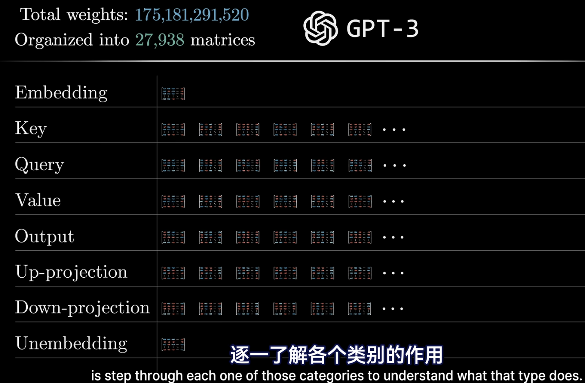
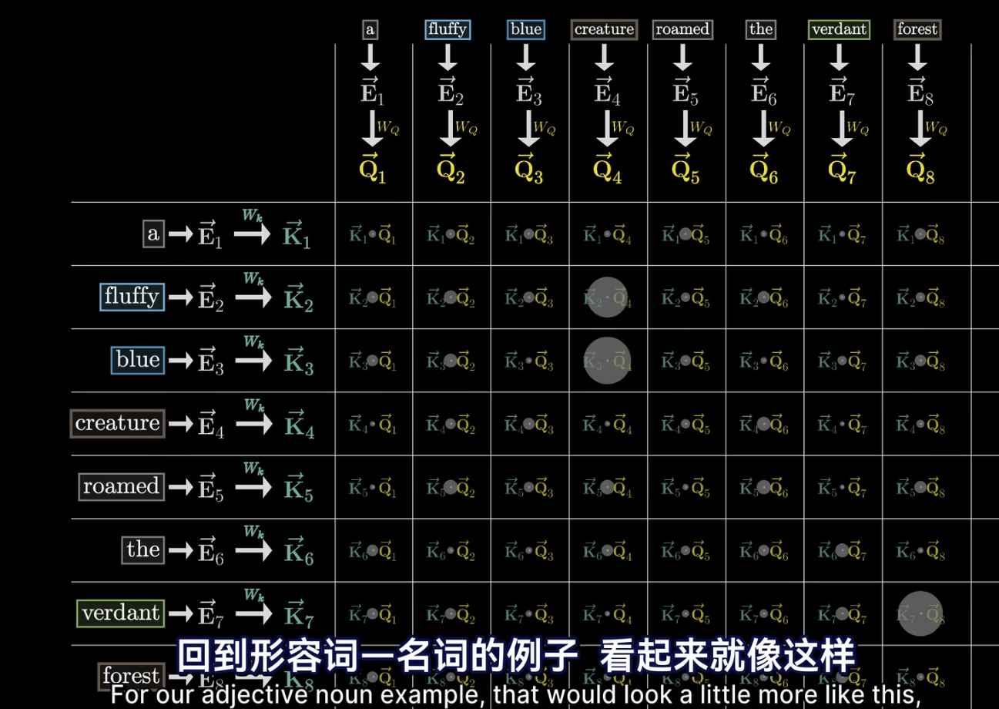
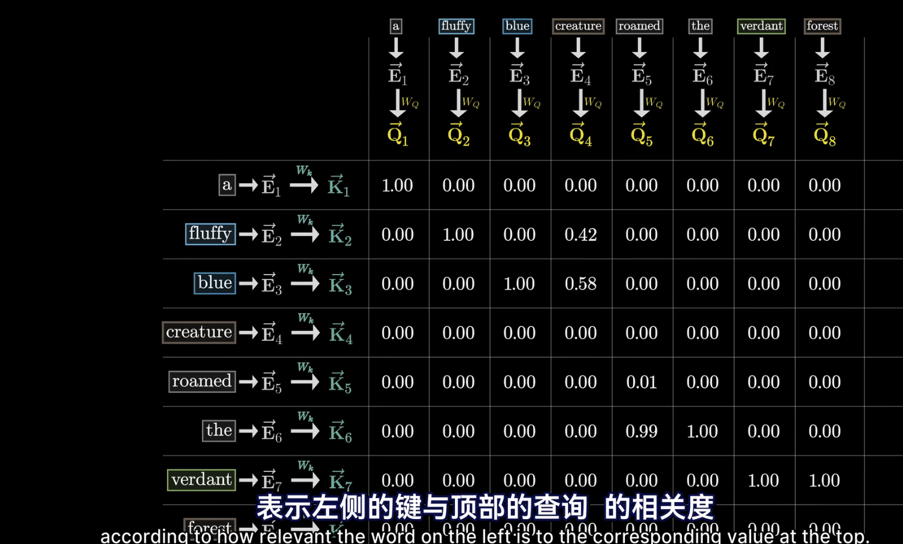
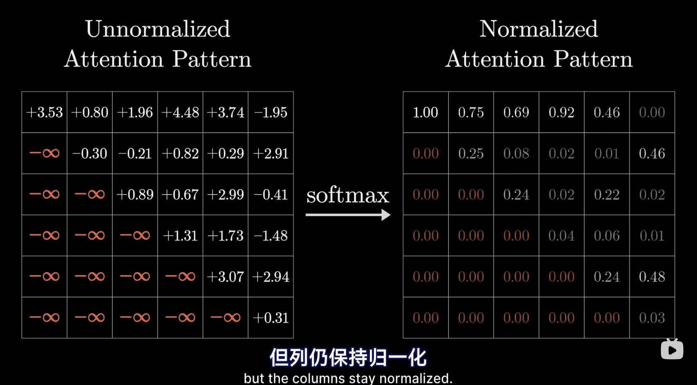
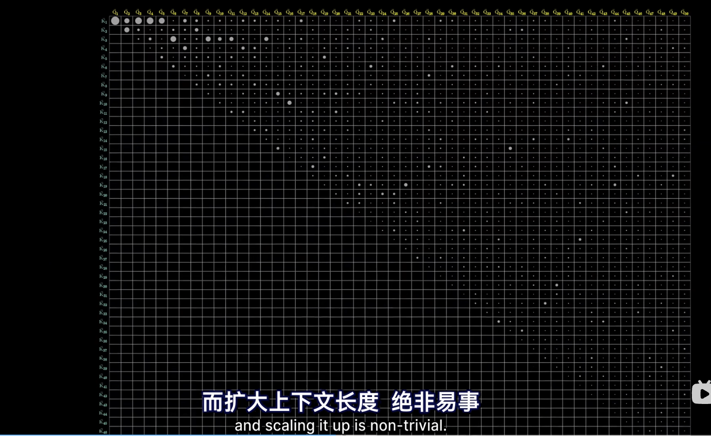
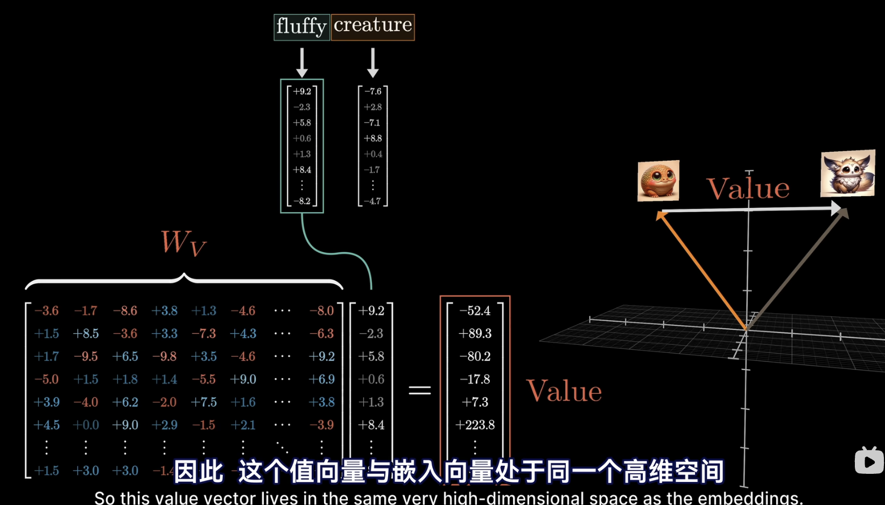
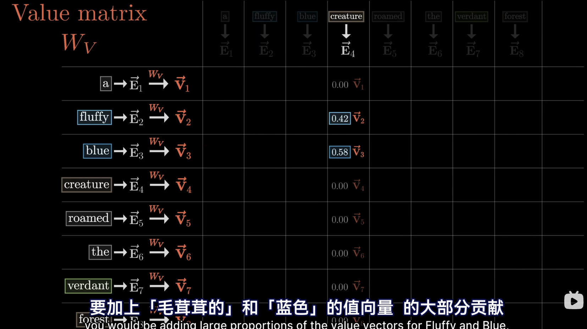
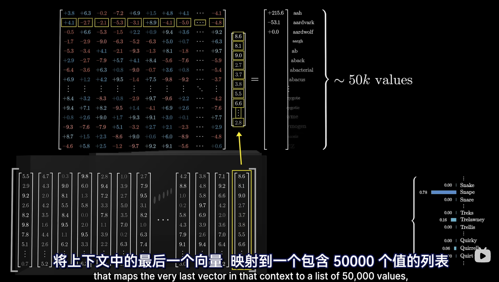

# Flow of gpt

## Tokenization and Embedding

Just do it.

## Attention block

Find the proper embedding of a given word based on its context.

E.g., these models have different meanings

- A machine learning **model**
- A fashion **model**

## MLP block

forward layers.

## loop the Attention block and the MLP block for many times

The intuition behind this is that after one embedding imbibes some of its context, there are many
more chances for this more nuanced embedding to be influenced by its more nuanced surroundings.

The further down network you go, with each embedding taking in more and more meaning from all the other embeddings,
which themselves are getting more and more nuanced.
The hop is that there's the capacity to encode higher level and more abstract ideas about a given input,
beyond just descriptors and grammatical structure.

## We want to get the last vector of the sequence, and create the probability distribution based on this vector.

# General idea of using GPT

We give the GPT an initial system prompt and the user question.
Use these as the input and let the GPT generate the answer.

# GPT-3 weight metrics groups

GPT-3 has 175 billion parameters: 175181291520 and organized into 27938 matrices.

# Dig into each layer

Before that, we need to know that **weight** is what we want to learn in the training process.
And **data** is the input and output of the model.

## Embedding metrics

GPT holds a list of all possible words in the vocabulary.
Each word is represented by a vector. (GPT-3 has 50257 vocabulary size and 12288 dimensions for each word)

**Embedding Layer is the first weight matrix in the model.**
So, it has 12288 * 50257 parameters = 617558016 parameters.

The embeddings of words can enable the model to understand the context of the word.
One word embedding can be influenced by the context (even very far away), called context size.
GPT-3 has 2048 context size, meaning that the model can understand the context of the word within 2048 words.
And the 2048 vectors are flowing through the network.

## Single head attention

The initial token embedding is effectively a lookup table with no reference to the context.
We need attention to understand the context of the word.

Remember, in transformer, we only use the last vector of the sequence to generate the output.
Therefore, assume that we input nearly whole detective fiction book, and the last sentence is
"therefore, the murderer was ___".

Now the transformer need to use the "was"'s vector to generate the murderer's name. That is, the "was"'s
vector must contain all the information of our input.

### Query metrics Q

Assuming that each word has embedding E. And it asks the other word: hey, do we have any adj before me?
So we need to use E x Wq (query metrics) to represent it: then we get Vq

Query metrics size: 12288 * 128 = 1572864

### Key metrics K

We need to use E x Wk (key metrics) to represent it: then we get Vk.

Key metrics size: 12288 * 128 = 1572864

#### How to illustrate?

The Vk is the answer of Vq.
E.g., if the word before it is an adj, the Vk * Vq will be a large number.

In ML, we say the embeddings of fluffy and blue attend to the embeddings of creature.

### Calculate the dot product of all Vq and Vk and apply a softmax

Note that we don't want the later word influence the pre word:
Therefore, we set the values of left below metrics to -INF before softmax.

Note that the size of the metric will be the square of input context size. That's why scaling it up is not trivial.

After this step, the words will understand which words are relevant and which are not.

### Value metrics V

Intuition, for the phrase "fluffy creature", we must change the creature's embedding based on fluffy
that more specifically encodes a Fluffy Creature.

The way to do it is that we multiply the fluffy vector with the value metrics V to get Vv.
Then we add Vv to the creature's embedding to get the new creature's embedding.

Key metrics size: 12288 * 12888 = 150994994

In practice, value metrics are seperated to two metrics: value down metrics and value up metrics.
The value up metrics is 12888 * 128 and value down metrics is 128 * 12888.

#### How to understand this?

We may think, if this word is relevant to adjust the meaning of something else, what exactly should
be added to the embedding of that something else in order to reflect this?

### Then, add Vv to E to get the new embedding of the word

## Multi-head attention

GPT-3 use 96 heads attention to produce 96 distinct attention patterns.
Each head has its distinct value matrix to produce 96 sequences of value vectors.

Which means, for each position in the context, each token, every attention head will produce a proposed change
to be added to the embedding in that position.

So you sum all the delta E from all the heads and add the result to the original embedding to get the new embedding.

The idea behind this is actually like the kernel of CNN.
Each head learns some feature of the context for the embedding.

GPT-3 has 96 heads, so the total parameters will be 96 * (sum of(Q, K, Vdown, Vup)) = 57 billion.
Around 1/3 of the total parameters.

## Unembedding metrics

Remember, the desired output is a probability distribution over all tokens that might come next.
For example, if the last words in input is Professor, and the context has Harry Potter and least favourite,
the model should output a high probability for the token Snape.

This process has two steps:

- First, the model will map the very last vector in that context to a list of all the vocabulary.
  
- Then, we use the softmax to convert the list of results to a probability distribution.

The unembedding layer has 12288 * 50257 parameters = 617558016 parameters. Just like the embedding layer.

### Softmax

Softmax converts a list of numbers to a probability distribution.
The largest number will be very close to 1, and the smallest number will be very close to 0.

#### Temperature

Temperature is a hyperparameter that can be used to control the randomness of the output.
The larger the temperature, the more random the output will be. The more risk we might have.
The api don't encourage use to use temperature larger than 2.